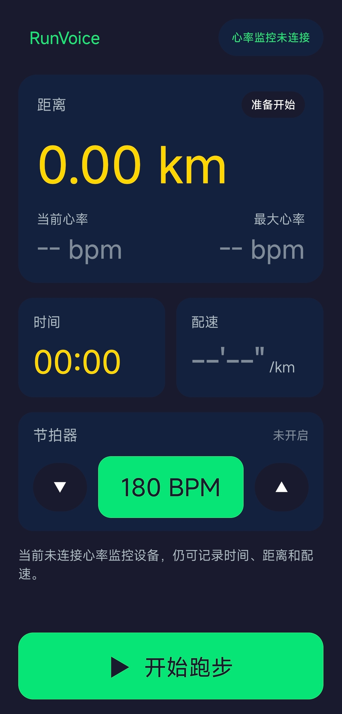

# RunVoice — 轻量跑步语音播报 APP

跑步时不想看手机？RunVoice 通过蓝牙耳机**语音播报**跑步数据，让你专注于跑步本身。

## 功能

- **GPS 追踪** — 实时距离累加、配速计算（FusedLocationProvider，2s 间隔，精度过滤）
- **配速平滑** — 速度异常过滤（0.5–7 m/s）+ 5 段中位数滤波，消除 GPS 跳点导致的配速飙高
- **静止漂移过滤** — 加速度传感器检测运动状态，静止时冻结距离累加，防止 GPS 漂移偷距离
- **GPS 轨迹留档** — 每次跑步自动保存原始定位点 CSV，记录定位点是否被接受、过滤原因、累计距离、分段距离和配速，便于和其他 APP 轨迹对比
- **BLE 心率** — 标准蓝牙心率监控设备（0x180D 协议），扫描/配对/自动重连，连接即显示心率（无需开跑）
- **语音播报** — 每跑完 1 公里中文语音播报：距离、用时、心率、配速；长时间活动达到 1 小时后自动改用“几小时几分几秒”格式
- **耳机单击即时播报** — 跑步中支持通过蓝牙耳机的单击媒体键触发一次当前数据播报（已在真机验证）
- **步频节拍器** — 160–220 BPM 可调，350Hz 正弦波脉冲，AudioTrack 硬件时钟驱动（无累积误差），状态自动记忆
- **结束页截图保存** — 结束确认页支持将结束日期时间、距离、总用时、平均配速和最大心率保存为本地海报版图片，便于后续自行分享
- **前台服务** — 息屏后 GPS/BLE/计时器持续运行，通知栏显示状态
- **极简 UI** — 距离为主读数，最大心率高亮，适合视力不便时配合耳机语音使用
- **关于页面** — 点击顶部 RunVoice 标题查看功能简介、使用说明和免责声明

## 截图



## 按钮交互

1. **开始跑步**（绿色大按钮）→ 进入跑步中
2. **暂停跑步**（红色大按钮）→ 计时暂停，数据保留
3. **继续跑步** / **结束本次**（两个按钮）→ 恢复跑步 或 进入结束确认页
4. **保存截图** / **保存数据** / **返回首页**（结束确认页）→ 保存结束摘要图片到本地 / 保留本次记录并停留在结算页 / 返回主界面
5. **耳机单击媒体键**（设备支持时）→ 立即播报当前距离、时间、当前心率、最大心率和配速

## 语音播报示例

> "已跑2公里，用时12分30秒，当前心率142，配速6分15秒"

即时播报示例：

> "当前已跑2.35公里，用时12分30秒，当前心率142，最大心率156，配速5分18秒每公里"

## 技术栈

- Kotlin + Jetpack Compose
- Android Foreground Service
- FusedLocationProviderClient（Google Play Services）
- BLE 标准心率协议
- Android TextToSpeech（中文）

## 项目结构

```
app/src/main/java/com/runvoice/
├── MainActivity.kt              # 入口 + 导航 + 权限处理
├── ui/
│   ├── RunScreen.kt             # 跑步主界面
│   ├── HrDeviceScreen.kt       # 心率监控设备扫描/连接
│   └── AboutScreen.kt          # 关于/免责声明
├── service/
│   └── RunningService.kt       # 前台服务，整合所有模块
├── tracker/
│   ├── GpsTracker.kt           # GPS 定位 + 距离/配速（含中位数平滑）
│   ├── GpsTraceRecorder.kt     # 跑步时轨迹 CSV 留档
│   ├── MotionDetector.kt       # 加速度传感器静止检测
│   ├── HeartRateMonitor.kt     # BLE 心率
│   └── RunTimer.kt             # 计时器
├── voice/
│   ├── VoiceAnnouncer.kt       # TTS 语音播报
│   └── Metronome.kt            # 步频节拍器（AudioTrack PCM）
└── model/
    └── RunData.kt              # 数据模型
```

## 权限

| 权限 | 用途 |
|------|------|
| `ACCESS_FINE_LOCATION` | GPS 定位 |
| `FOREGROUND_SERVICE` | 息屏后持续运行 |
| `BLUETOOTH` / `BLUETOOTH_SCAN` / `BLUETOOTH_CONNECT` | 连接心率监控设备 |
| `POST_NOTIFICATIONS` | 前台服务通知 |

## 构建

```bash
export JAVA_HOME=/path/to/jdk17
export ANDROID_HOME=/path/to/android-sdk
./gradlew assembleDebug
```

APK 输出：`app/build/outputs/apk/debug/app-debug.apk`

Release APK：

```bash
./gradlew assembleRelease
```

输出路径：`app/build/outputs/apk/release/app-release.apk`

## 安装

```bash
adb install -r app/build/outputs/apk/debug/app-debug.apk
```

## 使用

1. 打开 APP，授予定位权限（蓝牙权限可选）
2. （可选）点击"心率监控: 未连接"进入配对页面，扫描并选择心率设备
3. （可选）点击节拍器 BPM 按钮开启步频节拍，▲ / ▼ 调整 BPM（开关状态自动记忆）
4. 点击"开始跑步"，放入口袋，戴上蓝牙耳机
5. 每跑完 1 公里自动语音播报
6. （设备支持时）单击耳机媒体键，可随时触发一次即时播报
7. 跑完后点"暂停跑步" → "结束本次"
8. 结束确认页顶部显示本次结束日期和时间，并展示距离、总用时、平均配速和最大心率
9. 可选择"保存截图"、"保存数据"或"返回首页"
10. 点击顶部"RunVoice"可查看关于页面和免责声明

截图说明：

- 导出图片为独立海报版排版，不与 APP 页面布局绑定
- 顶部日期和时间居中显示
- 摘要区统一展示：距离、总用时、平均配速、最大心率

## GPS 轨迹调试

为了分析 RunVoice 与其他跑步 APP 的距离差异，每次跑步会生成一份 GPS 轨迹 CSV。

- 结束时选择 **保存数据**：保留本次 GPS 轨迹 CSV，并继续停留在结束页以便后续保存截图
- 结束时选择 **返回首页**：若尚未保存数据，则删除本次 GPS 轨迹 CSV；随后返回主界面
- 结束页当前建议操作顺序：先 **保存截图**，再 **保存数据**，最后 **返回首页**

导出目录：

```bash
adb pull /sdcard/Android/data/com.runvoice/files/gps-traces ./gps-traces
```

详细字段说明见 [docs/gps-trace-debugging.md](docs/gps-trace-debugging.md)。

和其他跑步 App 对比时，建议额外导出对方的 GPX 轨迹，并注意：

- 尽量让两个 App 同时开始、同时结束
- 如果结束后原地停留较久，不同 App 对原地漂移和静止状态的处理可能不同，尾段距离容易拉开
- 先对比同一时间范围内的轨迹点，再判断是 GPS 丢点、静止过滤还是停止时机差异
- Organic Maps 可导出 GPX，RunVoice 可导出 CSV，两者结合更容易定位问题

## 当前数据保存范围

当前版本结束跑步后的“保存数据 / 返回首页”，实际控制的是本次会话及 GPS 轨迹文件是否保留。

- 已实现：GPS 轨迹 CSV 留档与丢弃
- 已实现：结束摘要截图保存到本地图片目录
- 尚未实现：单次跑步摘要历史、历史列表、周/月汇总页

## 要求

- Android 8.0+（API 26）
- Google Play Services（GPS）
- 蓝牙 4.0+（心率监控功能）

## Roadmap

### ~~GPS 配速平滑~~（已实现）

- ✅ **速度异常过滤** — < 0.5 m/s（静止漂移）或 > 7 m/s（GPS 跳点）时丢弃该段
- ✅ **中位数滤波** — 最近 5 段配速取中位数，抗异常值优于均值
- ✅ **加速度静止检测** — LINEAR_ACCELERATION 传感器判断运动状态，静止时冻结距离累加

后续可进一步加入：

- **卡尔曼滤波** — 融合 GPS 位置与速度，平滑轨迹抖动，减少静止/慢跑时的漂移虚高
- **角度异常检测** — 过滤不合理的急转角（如 180° 折返），避免信号反射导致的锯齿路径
- **自适应采样** — 弯道密集区域提高采样频率，直道降低，兼顾精度与功耗

### 心率区间控制

基于最大心率（220 - 年龄）划分训练区间，跑步中实时语音提醒：

| 区间 | 心率范围 | 用途 | 语音提示 |
|------|---------|------|---------|
| 热身区 | 50-60% HRmax | 热身/恢复 | — |
| 燃脂区 | 60-70% HRmax | 减脂慢跑 | — |
| 有氧区 | 70-80% HRmax | 耐力训练 | — |
| 无氧区 | 80-90% HRmax | 速度训练 | "心率偏高，注意控制" |
| 极限区 | 90-100% HRmax | 冲刺 | "心率过高，请减速" |

- 用户设置年龄和目标区间，超出上限/下限时语音警告
- 警告间隔可配置（如每 30 秒最多提醒一次，避免频繁打扰）

### 跑步数据持久化与分析

完整路线见 [docs/roadmap.md](docs/roadmap.md)。

当前优先级：

- **先积累原始数据** — 先持续保留足够多的真实跑步原始数据，再决定历史页和分析指标的最终形态
- **保存每次跑步数据** — 在原始数据积累到一定阶段后，再把单次跑步摘要稳定落盘
- **历史记录与汇总页** — 后续再做最近记录、周/月跑量、历史最好成绩、最大心率趋势
- **训练分析** — 最后再做有氧 / 无氧、心率区间和即时训练提醒

当前记录下来的想法：

- **月跑量** — 按自然月汇总距离、次数和总时长
- **历史最好记录** — 例如最长距离、最快平均配速、最高心率
- **最近跑步列表** — 先回顾最近几次跑步，再逐步补周/月汇总
- **趋势回顾** — 后续观察最大心率、配速稳定性和训练频率变化
- **延后决定字段** — 等积累一段时间真实数据后，再决定哪些指标值得长期保留和展示

## 许可证

[MIT License](LICENSE)
