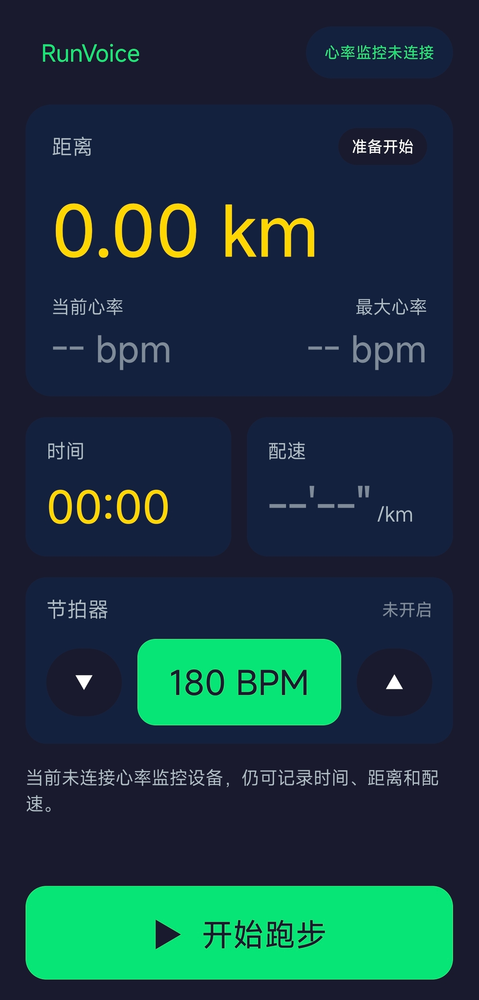

# RunVoice — 轻量跑步语音播报 APP

跑步时不想看手机？RunVoice 通过蓝牙耳机**语音播报**跑步数据，让你专注于跑步本身。

## 功能

- **GPS 追踪** — 实时距离累加、配速计算（FusedLocationProvider，2s 间隔，精度过滤）
- **配速平滑** — 速度异常过滤（0.5–7 m/s）+ 5 段中位数滤波，消除 GPS 跳点导致的配速飙高
- **静止漂移过滤** — 加速度传感器结合 GPS 持续移动确认；进入静止后锁定计数，恢复前必须满足持续 GPS 位移和速度稳定性，恢复时从静止锚点补回直线位移，减少静止漂移、误恢复和漏计距离
- **GPS 轨迹留档** — 每次跑步自动保存原始定位点 CSV，记录定位点是否被接受、过滤原因、累计距离、分段距离和配速，便于和其他 APP 轨迹对比
- **BLE 心率** — 标准蓝牙心率监控设备（0x180D 协议），扫描/配对/自动重连，连接即显示心率（无需开跑）
- **语音播报** — 每跑完 1 公里中文语音播报：距离、用时、心率、配速；两个整公里播报之间，在 0.25 / 0.50 / 0.75 公里处补充播报一次当前配速；长时间活动达到 1 小时后自动改用“几小时几分几秒”格式
- **语音防吞字** — 所有语音提示前先播放一个极短的 `click/beep` 预热音，再触发中文 TTS，减少部分手机或蓝牙耳机链路的句首吞字
- **静止判定提醒** — 连续判定静止 5 秒后语音提示“检测为静止”，恢复运动并重新计数时提示“已恢复运动，继续计数”，帮助及时发现真正停下或传感器误判
- **耳机单击即时播报** — 跑步中支持通过蓝牙耳机的单击媒体键触发一次当前时间和跑步数据播报，其中配速使用自起点到当前时刻的平均配速（已在真机验证）
- **步频节拍器** — 160–220 BPM 可调，350Hz 正弦波脉冲，AudioTrack 硬件时钟驱动（无累积误差），状态自动记忆
- **结束页截图保存** — 结束确认页支持将本次 GPS 航迹与结束日期时间、距离、总用时、平均配速和最大心率套印为本地海报版图片；若轨迹点不足则自动降级为纯摘要图片
- **前台服务** — 息屏后 GPS/BLE/计时器持续运行，通知栏显示状态
- **极简 UI** — 距离为主读数，最大心率高亮，适合视力不便时配合耳机语音使用
- **关于页面** — 点击顶部 RunVoice 标题查看功能简介、使用说明和免责声明

## 截图



## 按钮交互

1. **开始跑步**（绿色大按钮）→ 进入跑步中
2. **暂停跑步**（红色大按钮）→ 计时暂停，数据保留
3. **继续跑步** / **结束本次**（两个按钮）→ 恢复跑步 或 进入结束确认页
4. **保存截图** / **保存数据** / **返回首页**（结束确认页）→ 保存结束摘要图片到本地 / 保留本次记录并停留在结算页 / 返回主界面
5. **耳机单击媒体键**（设备支持时）→ 立即播报当前时间、当前距离、用时、当前心率、最大心率和平均配速

## 语音播报示例

> "已跑2公里，用时12分30秒，当前心率142，配速6分15秒"

0.25 公里阶段配速播报示例：

> "当前配速6分10秒每公里"

即时播报示例：

> "现在时间14点5分，当前已跑2.35公里，用时12分30秒，当前心率142，最大心率156，平均配速5分18秒每公里"

语音预热说明：

- 所有语音播报当前使用“短提示音预热 + TTS”方案
- 这是为了规避部分 Android 机型或蓝牙耳机在语音刚起播时吞掉前 1 到 2 个字的问题
- 整公里播报仍包含距离、用时、心率和当前配速；整公里之间的 0.25 / 0.50 / 0.75 公里节点只播报当前配速，减少打扰
- 耳机单击即时播报中的配速为平均配速，按当前用时除以从起点累计距离计算
- 当连续判定静止 5 秒后，会播报“检测为静止”；恢复运动并重新计数时，会播报“已恢复运动，继续计数”；同一段静止/误判期间最多每 60 秒提醒一次
- 静止后不会因为加速度计短暂变动而立即恢复计数；必须由 GPS 持续位移确认，并且最近几段 GPS 速度保持在合理且相对稳定的范围内
- 拿起手机、晃动手机或原地蹦跳/跳绳这类“有加速度但没有真实位移”的动作，预期仍保持静止计数状态

## 技术栈

- Kotlin + Jetpack Compose
- Android Foreground Service
- FusedLocationProviderClient（Google Play Services）
- BLE 标准心率协议
- Android TextToSpeech（中文）+ 短提示音预热

## 项目结构

```
app/src/main/java/com/runvoice/
├── MainActivity.kt              # 入口 + 导航 + 权限处理
├── ui/
│   ├── RunScreen.kt             # 跑步主界面
│   ├── HrDeviceScreen.kt       # 心率监控设备扫描/连接
│   └── AboutScreen.kt          # 关于/免责声明
├── service/
│   └── RunningService.kt       # 前台服务，整合所有模块
├── core/
│   ├── RunSessionController.kt # 纯 Kotlin 跑步会话状态机
│   ├── TrackingEngine.kt       # 纯 Kotlin GPS 接受/距离/配速决策
│   └── AnnouncementPolicy.kt  # 公里与阶段配速播报策略
├── tracker/
│   ├── GpsTracker.kt           # Android 定位适配器
│   ├── GpsTraceRecorder.kt     # 跑步时轨迹 CSV 留档
│   ├── MotionDetector.kt       # 加速度传感器静止检测
│   ├── HeartRateMonitor.kt     # BLE 心率
│   └── RunTimer.kt             # 计时器
├── share/
│   ├── RunSummaryImageSaver.kt # 跑后摘要 Canvas 渲染
│   ├── TraceCsvReader.kt       # 轨迹 CSV 解析
│   ├── TraceGeometry.kt        # 投影与复走识别
│   └── RunSummaryImageStorage.kt # 图片存储适配器
├── voice/
│   ├── VoiceAnnouncer.kt       # TTS 语音播报 + 短提示音预热
│   └── Metronome.kt            # 步频节拍器（AudioTrack PCM）
└── model/
    └── RunData.kt              # 数据模型
```

## 权限

| 权限 | 用途 |
|------|------|
| `ACCESS_FINE_LOCATION` | GPS 定位 |
| `FOREGROUND_SERVICE` | 息屏后持续运行 |
| `BLUETOOTH` / `BLUETOOTH_SCAN` / `BLUETOOTH_CONNECT` | 连接心率监控设备 |
| `POST_NOTIFICATIONS` | 前台服务通知 |

## 构建

```bash
export JAVA_HOME=/path/to/jdk17
export ANDROID_HOME=/path/to/android-sdk
./gradlew assembleDebug
```

APK 输出：`app/build/outputs/apk/debug/app-debug.apk`

Release APK：

```bash
./gradlew assembleRelease
```

未签名输出路径：`app/build/outputs/apk/release/app-release-unsigned.apk`

## 安装

```bash
adb install -r app/build/outputs/apk/debug/app-debug.apk
```

## 使用

1. 打开 APP，授予定位权限（蓝牙权限可选）
2. （可选）点击"心率监控: 未连接"进入配对页面，扫描并选择心率设备
3. （可选）点击节拍器 BPM 按钮开启步频节拍，▲ / ▼ 调整 BPM（开关状态自动记忆）
4. 点击"开始跑步"，放入口袋，戴上蓝牙耳机
5. 每跑完 1 公里自动语音播报；两个整公里之间的 0.25 / 0.50 / 0.75 公里处自动播报当前配速
6. （设备支持时）单击耳机媒体键，可随时触发一次包含当前时间和平均配速的即时播报
7. 跑完后点"暂停跑步" → "结束本次"
8. 结束确认页顶部显示本次结束日期和时间，并展示距离、总用时、平均配速和最大心率
9. 可选择"保存截图"、"保存数据"或"返回首页"
10. 点击顶部"RunVoice"可查看关于页面和免责声明

截图说明：

- 导出图片为独立海报版排版，不与 APP 页面布局绑定
- 当本次跑步存在至少 2 个有效 GPS 点时，导出图片会用 GPS CSV 中 `decision=accepted` 的点绘制航迹，并把跑步数据叠加在同一张图上
- 航迹图首版不依赖在线地图瓦片；没有底图或轨迹点不足时，截图功能仍可用
- 顶部日期和时间居中显示
- 摘要区统一展示：距离、总用时、平均配速、最大心率

## GPS 轨迹调试

为了分析 RunVoice 与其他跑步 APP 的距离差异，每次跑步会生成一份 GPS 轨迹 CSV。

- 结束时选择 **保存数据**：保留本次 GPS 轨迹 CSV，并复制一份到公共 Documents 目录；随后继续停留在结束页以便后续保存截图
- 结束时选择 **返回首页**：若尚未保存数据，则删除本次 GPS 轨迹 CSV；随后返回主界面
- 结束页当前建议操作顺序：先 **保存截图**，再 **保存数据**，最后 **返回首页**

稳定留档目录：

```bash
adb pull /sdcard/Documents/RunVoice/gps-traces ./gps-traces
```

临时工作目录：

```bash
adb pull /sdcard/Android/data/com.runvoice/files/gps-traces ./gps-traces
```

公共 Documents 目录中的 CSV 不随 App 卸载或重装清除；App 专属目录中的临时 CSV 仍可能在 App 数据被清除时丢失。

详细字段说明见 [docs/gps-trace-debugging.md](docs/gps-trace-debugging.md)。

和其他跑步 App 对比时，建议额外导出对方的 GPX 轨迹，并注意：

- 尽量让两个 App 同时开始、同时结束
- 如果结束后原地停留较久，不同 App 对原地漂移和静止状态的处理可能不同，尾段距离容易拉开
- 先对比同一时间范围内的轨迹点，再判断是 GPS 丢点、静止过滤还是停止时机差异
- 静止恢复相关过滤会在 `reason` 字段中记录原因，例如 `stationary_locked_gps_still`、`stationary_locked_waiting_for_gps_confirmation`、`stationary_locked_rejected_resume_speed`、`stationary_locked_waiting_for_stable_gps_speed`
- Organic Maps 可导出 GPX，RunVoice 可导出 CSV，两者结合更容易定位问题

## 当前数据保存范围

当前版本结束跑步后的“保存数据 / 返回首页”，实际控制的是本次会话及 GPS 轨迹文件是否保留。

- 已实现：GPS 轨迹 CSV 留档与丢弃
- 已实现：保存数据时将 GPS 轨迹 CSV 复制到公共 Documents 目录，降低 App 重装导致原始轨迹丢失的风险
- 已实现：结束摘要截图保存到本地图片目录
- 尚未实现：单次跑步摘要历史、历史列表、周/月汇总页

隐私提醒：GPS CSV 包含精确路线、时间、速度、海拔和心率。公共导出位于
`Documents/RunVoice/gps-traces`，卸载 App 不会自动删除；分享或提交文件前请先脱敏，
不再需要时请通过系统文件管理器手动删除。

## 会话恢复策略

当前版本在系统终止进程后不会尝试用空白内存状态“恢复”跑步，也不会自动重启前台服务。
重新打开 App 时会明确回到“准备开始”状态。后续只有在实现完整 checkpoint 持久化和恢复校验后，
才会重新启用进程重建后的会话续跑。

## 要求

- Android 8.0+（API 26）
- Google Play Services（GPS）
- 蓝牙 4.0+（心率监控功能）

## Roadmap

### ~~GPS 配速平滑~~（已实现）

- ✅ **速度异常过滤** — < 0.5 m/s（静止漂移）或 > 7 m/s（GPS 跳点）时丢弃该段
- ✅ **中位数滤波** — 最近 5 段配速取中位数，抗异常值优于均值
- ✅ **加速度静止检测** — LINEAR_ACCELERATION 传感器判断运动状态，结合 GPS 持续移动确认，兼顾静止漂移过滤和误判恢复
- ✅ **静止恢复防误触** — 进入静止状态后，恢复计数需要满足持续 GPS 位移、累计距离、起终点位移和最近 GPS 段速度稳定性，避免拿手机、晃动、原地跳动触发恢复

后续可进一步加入：

- **卡尔曼滤波** — 融合 GPS 位置与速度，平滑轨迹抖动，减少静止/慢跑时的漂移虚高
- **角度异常检测** — 过滤不合理的急转角（如 180° 折返），避免信号反射导致的锯齿路径
- **自适应采样** — 弯道密集区域提高采样频率，直道降低，兼顾精度与功耗

### 心率区间控制

基于最大心率（220 - 年龄）划分训练区间，跑步中实时语音提醒：

| 区间 | 心率范围 | 用途 | 语音提示 |
|------|---------|------|---------|
| 热身区 | 50-60% HRmax | 热身/恢复 | — |
| 燃脂区 | 60-70% HRmax | 减脂慢跑 | — |
| 有氧区 | 70-80% HRmax | 耐力训练 | — |
| 无氧区 | 80-90% HRmax | 速度训练 | "心率偏高，注意控制" |
| 极限区 | 90-100% HRmax | 冲刺 | "心率过高，请减速" |

- 用户设置年龄和目标区间，超出上限/下限时语音警告
- 警告间隔可配置（如每 30 秒最多提醒一次，避免频繁打扰）

### 跑步数据持久化与分析

完整路线见 [docs/roadmap.md](docs/roadmap.md)。

当前优先级：

- **先积累原始数据** — 先持续保留足够多的真实跑步原始数据，再决定历史页和分析指标的最终形态
- **保存每次跑步数据** — 在原始数据积累到一定阶段后，再把单次跑步摘要稳定落盘
- **历史记录与汇总页** — 后续再做最近记录、周/月跑量、历史最好成绩、最大心率趋势
- **训练分析** — 最后再做有氧 / 无氧、心率区间和即时训练提醒

当前记录下来的想法：

- **月跑量** — 按自然月汇总距离、次数和总时长
- **历史最好记录** — 例如最长距离、最快平均配速、最高心率
- **最近跑步列表** — 先回顾最近几次跑步，再逐步补周/月汇总
- **趋势回顾** — 后续观察最大心率、配速稳定性和训练频率变化
- **延后决定字段** — 等积累一段时间真实数据后，再决定哪些指标值得长期保留和展示

### 轨迹显示与截图

目标是生成类似 Organic Maps 轨迹图效果的跑后轨迹截图，用于历史记录回顾和分享。

产品要求：

- **优先做跑后截图** — 首版不做完整地图浏览器，先支持从本次 GPS CSV 生成一张带底图的轨迹图片
- **参考 Organic Maps 体验** — 参照其轨迹线颜色、线宽、起终点标记、视野自动缩放、边距和截图构图
- **支持无底图降级** — 没有离线地图数据时，也能生成纯轨迹图，避免截图功能不可用
- **接入历史记录** — 后续每次跑步保存摘要、CSV 路径和可选轨迹截图路径

技术要求：

- **不要直接依赖 openstreetmap.org 在线瓦片** — 避免对官方公共瓦片服务产生第三方 App 流量依赖
- **优先离线地图包** — 支持用户导入或预置区域离线地图数据，例如武汉/湖北/中国某区域
- **底层库待评估** — 优先评估 mapsforge；若后续需要更强样式和交互能力，再评估 MapLibre
- **不直接嵌入 Organic Maps 内核** — Organic Maps 是大型 C++/Java 离线导航系统，可参考实现思路和体验，但不适合作为 RunVoice 的轻量地图 SDK 直接集成
- **注意授权署名** — 使用 OSM 数据或参考 Organic Maps 资源时，需要在截图或关于页面保留可见 attribution，例如 `© OpenStreetMap contributors`

## 许可证

[MIT License](LICENSE)
